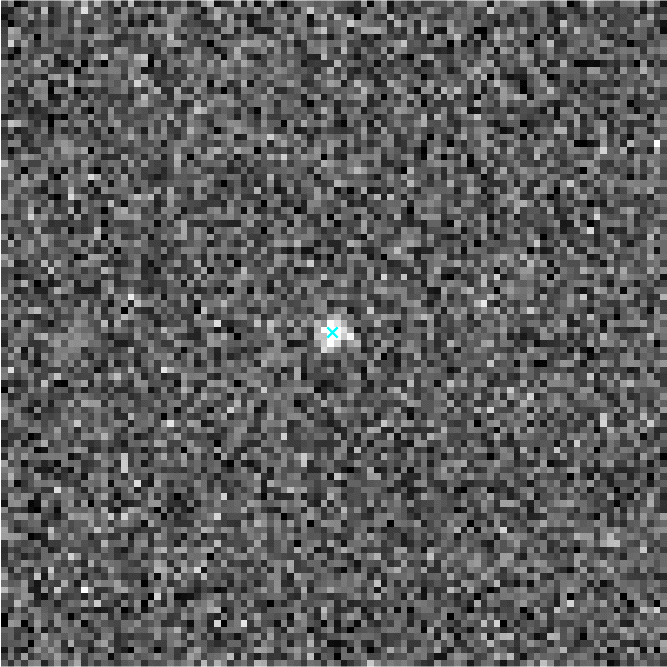
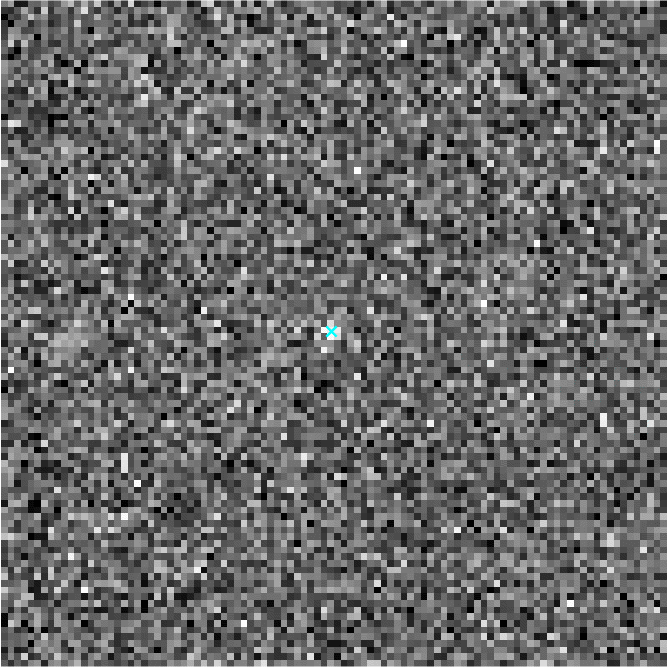

# Single-Particle Tracking — Simulation, Classical & ML

A self-contained MATLAB project that **simulates** fluorescence microscopy
images of a single fluorophore, **tracks** the particle as it diffuses, and
does the same with a small **neural network**.

Because the images are synthetic, the true position of the particle in every
frame is known exactly, so the trackers can be scored against ground truth.

<!-- Replace the paths with your committed GIFs -->
| Bright particle (high signal) | Dim particle (low signal) |
|---|---|
|  |  |

*Cyan trail: true path. Cyan cross: tracked path. When the particle is bright
the two overlap; as the signal drops, the tracked position scatters around the
truth.*

## 1. Simulating the images

Each frame is built the way a real camera would record a single fluorophore:

- the point source is blurred by the microscope's **point-spread function** (a
  Gaussian), placed at a sub-pixel position;
- **photon shot noise** is added (Poisson statistics);
- the signal is scaled by the **camera gain**, and **read noise** and a constant
  **offset** are added, before quantizing to a 16-bit image.

The brightness is set by a single `signal` parameter (total photons), so making
the particle dimmer is as simple as lowering one number.

The particle moves by **Brownian motion**: each frame it takes a small random
step, producing a realistic diffusing trajectory.

## 2. Classical tracking

The classical tracker finds the particle in each frame in two steps:

1. **Detect** — smooth the frame with a small Gaussian to suppress noise, then
   take the brightest pixel as a rough guess of the particle's location.
2. **Refine** — crop a small region around that pixel and fit a **2D Gaussian**
   to it. The center of the fitted Gaussian is the sub-pixel position.

Doing this frame by frame gives the full trajectory.

## 3. Machine-learning tracking

Instead of fitting a Gaussian, a small **convolutional neural network** is
trained to read a cropped patch and output the particle's sub-pixel position
directly.

The training data is generated by the simulator itself: thousands of synthetic
patches, each labeled with the exact position it was rendered at. The network
uses the *same* detection step as the classical tracker, so only the final
refinement differs.

**Result:** the network reaches accuracy very close to the classical Gaussian
fit. For a clean single particle, both approaches localize it about equally
well.

| Bright particle (high signal) ML track | Dim particle (low signal) ML track |
|---|---|
|  |  |

## Quick start

```matlab
% --- simulate a movie of one diffusing particle ---
rng(1)
pos   = brownianMotion(120, struct('D',0.05));
stack = zeros([32 32 120], 'uint16');
ip    = struct('signal',1000, 'background',8);
for t = 1:120
    stack(:,:,t) = simulateParticleImage(pos(t,:), [32 32], ip);
end

% --- classical tracking ---
posFit = trackGaussianFit(stack, struct('sigmaPSF',1.3));

% --- ML tracking ---
[X, Y] = generateTrainingData(100000, struct('signalRange',[50 1000]));
net    = trainParticleNet(X, Y);
posML  = trackMLmatlab(stack, net, struct('patchHalf',7));

% --- compare to ground truth ---
rmseFit = sqrt(mean(sum((posFit - pos).^2, 2)));
rmseML  = sqrt(mean(sum((posML  - pos).^2, 2)));

% --- make a GIF ---
makeTrackingGIF(stack, pos, posFit, 'figures/track.gif');
```

## Requirements

- MATLAB. Simulation and classical tracking use base MATLAB only.
- **Deep Learning Toolbox** for the neural-network tracker.

## Possible extensions

- Multiple particles at once (multi-peak detection + frame-to-frame linking).
- Overlapping particles closer than the PSF width, where a learned model can
  separate spots a single Gaussian fit cannot.

## Files

| File | Role |
|---|---|
| `simulateParticleImage.m` | Camera image of a sub-pixel fluorophore |
| `brownianMotion.m` | 2D diffusing trajectory |
| `detectAndExtract.m` | Shared detection + patch extraction |
| `trackGaussianFit.m` | Classical 2D Gaussian-fit tracker |
| `generateTrainingData.m` | Synthetic labeled patches for the network |
| `trainParticleNet.m` | Defines and trains the network |
| `trackMLmatlab.m` | Neural-network tracker |
| `measureD.m` | Diffusion coefficient from the trajectory |
| `makeTrackingGIF.m` | Animated tracking overlay |
